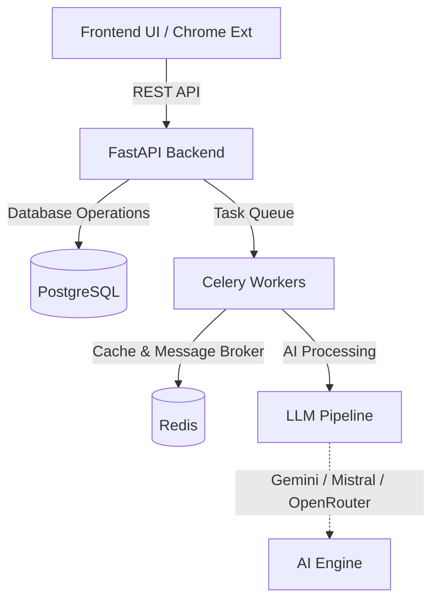

<div align="center">
  <!-- Professional Banner Placeholder: Add an image here -->
  <!--  -->
  
  <h1>Pathlight.ai</h1>
  <p><strong>Full ATS-Optimized Resume Tailoring Platform & LLM Pipeline</strong></p>
  
  <div>
    <a href="https://github.com/jayanthkumar10/PathLight.ai/actions"></a>
    <a href="https://github.com/jayanthkumar10/PathLight.ai/blob/main/LICENSE"></a>
    
  </div>
  <br>
  <div>
    
    
    
    
    
    
  </div>
</div>

<br>

## What is Pathlight?
Pathlight is an intelligent platform designed to automatically tailor resumes to specific job descriptions using advanced AI models. It acts as an autonomous pipeline that digests raw job descriptions and generates highly specific, ATS-compliant resumes tailored precisely for the role.

## Why Pathlight Exists
Job seekers often struggle to get their resumes past automated Applicant Tracking Systems (ATS), resulting in qualified candidates being rejected before a human even reviews their application. Manually tailoring a resume for every single job application is incredibly time-consuming and imprecise. Pathlight automates this workflow, saving hours of work while drastically improving interview callback rates.

## Key Features
- **AI-Powered Resume Tailoring:** Leverages Gemini, Mistral, and other state-of-the-art LLMs to rewrite and optimize resume content perfectly.
- **Chrome Extension Integration:** Seamlessly start tailoring jobs directly from job boards like LinkedIn with a single click.
- **ATS Scoring:** Automatically calculates ATS fit and match scores based on the provided job description.
- **PDF Generation:** Exports the fully tailored resume to a clean, highly ATS-readable PDF format.
- **Application Tracking:** Built-in dashboard to manage all your tailored resumes and track your job application statuses.

## Architecture Overview

*(For detailed architectural diagrams, see [docs/Architecture.md](docs/Architecture.md))*

## Folder Overview
```text
.
├── backend/            # FastAPI source code, Routers, and LLM Pipelines
├── extension/          # Chrome Extension source for 1-click scraping
├── public/             # Static Vanilla HTML/CSS/JS Frontend served by FastAPI
├── scripts/            # Helper scripts (DB setup, migrations)
├── docs/               # Comprehensive project documentation
├── .github/            # GitHub Actions and Issue/PR Templates
├── docker-compose.yml  # Docker orchestration
└── requirements.txt    # Python dependencies
```

## Agent / Pipeline Overview
The core tailoring logic runs asynchronously via Celery in `backend/services/pipeline.py`. 
1. **Intake**: Extracts JD via Apify or raw text.
2. **Analysis**: LLM extracts hard requirements, soft skills, and YOE.
3. **Rewrite**: Cross-references with the user's Master Profile to inject matching keywords.
4. **Compile**: Converts the optimized HTML to a downloadable ATS-friendly PDF.
*(Read more in [docs/Agents.md](docs/Agents.md))*

## API Overview
The REST API supports standard endpoints for triggering generations and checking statuses:
- `POST /api/tailor`: Trigger a new background generation.
- `GET /api/tailor/{job_id}`: Poll background task status.
- `GET /api/applications/{app_id}/pdf`: Download the generated resume.
*(Full API spec available in [docs/API.md](docs/API.md))*

## Installation & Database Setup
1. Clone the repository to your local machine:
   ```bash
   git clone https://github.com/jayanthkumar10/PathLight.ai.git
   cd PathLight.ai
   ```
2. Set up your environment variables (see below).
3. The database (PostgreSQL) is automatically set up and seeded via Docker Compose.

## Environment Variables
Copy the example environment file to `.env`:
```bash
cp .env.example .env
```
Populate the required API keys (Gemini, OpenRouter, Apify, etc.) inside your new `.env` file. *(See [docs/Environment.md](docs/Environment.md) for a detailed breakdown).*

## Running the Application (Backend & Frontend)
The easiest way to run the entire backend stack (FastAPI, PostgreSQL, Redis, Celery) and the Frontend is by using Docker Compose:

```bash
docker-compose up -d --build
```
Alternatively, you can use the provided startup scripts for local development:
```bash
./start.bat  # On Windows
./start.sh   # On Linux/macOS
```
The Frontend and API will both be available at `http://localhost:8000`. Interactive API documentation is automatically generated and available at `http://localhost:8000/docs`.

## Screenshots
*(Add screenshots of the Pathlight dashboard and generated resumes here)*
<!--  -->

## Development Workflow
If you are developing locally without Docker, read the [Development Guide](docs/Development.md). Ensure you have PostgreSQL and Redis running locally before starting the FastAPI server and Celery worker.

## Roadmap
See [ROADMAP.md](ROADMAP.md) for our strategic vision, including local LLM support (Ollama) and autonomous agentic workflows.

## Contributing
Contributions are always welcome! Please read our [Contributing Guidelines](docs/Contributing.md) and [Code of Conduct](CODE_OF_CONDUCT.md) before submitting a pull request.

## Support
If you encounter any issues, please refer to [docs/Troubleshooting.md](docs/Troubleshooting.md). For persistent bugs, open a GitHub Issue using the Bug Report template.

## Credits
Built with modern open-source technologies including FastAPI, Celery, PostgreSQL, Redis, and LangChain concepts.

## License
This project is licensed under the MIT License - see the [LICENSE](LICENSE) file for details.
