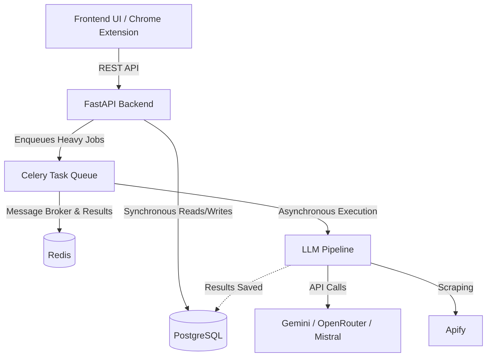

# Architecture Overview

Pathlight.ai is built on a modern, decoupled architecture designed for performance and scalability in processing heavy LLM requests.

## High-Level Architecture Diagram

## Components

### 1. Frontend & Chrome Extension
The frontend is built using standard HTML5/JS/CSS served directly out of the `public/` directory by FastAPI. A Chrome extension is also provided in `extension/` to scrape job details directly from job boards (e.g., LinkedIn) and submit them to the backend.

### 2. FastAPI Backend
The core API is built with Python 3.11 and FastAPI (`backend/main.py`). It handles:
- Authentication & JWT validation
- Serving static frontend files
- API routing for the Dashboard, Tailoring Jobs, and Resumes
- Synchronous interactions with the database via SQLAlchemy

### 3. Celery Task Queue
Tailoring a resume via LLMs can take anywhere from 10 to 60 seconds. Doing this synchronously would block the API and cause timeouts. Thus, tailoring jobs are pushed to a Celery worker pool (`backend/celery_app.py`) which processes them asynchronously.

### 4. Redis (Broker & Cache)
Redis is used as the message broker for Celery. When the FastAPI backend pushes a task, it goes into Redis. The Celery workers continuously poll Redis for new jobs.

### 5. PostgreSQL (State & Storage)
PostgreSQL stores all persistent state, including:
- User Profiles (Master Resumes)
- Tailoring Jobs and Statuses
- Generated Applications and ATS Scores
- Cached Job Descriptions (to prevent re-evaluating the same job multiple times)

### 6. AI Pipeline
The `backend/services/pipeline.py` is the orchestrator. It fetches raw text, interacts with LLM providers (Google Gemini, Mistral, OpenRouter) to parse and inject keywords, and finally uses `weasyprint` or `reportlab` (via PDF generation modules) to spit out a beautifully formatted, ATS-compliant PDF.
